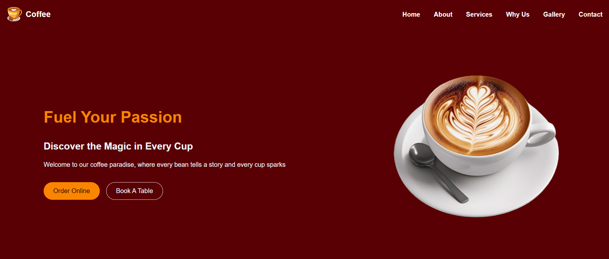

# Coffee Shop Website

The Coffee shop website built with React. The website showcases the coffee shop's offerings, ambiance, and services.


## 📖 Pages

The website consists of the following pages:

1. **Home**: Introduces the coffee shop with a catchy tagline and call-to-action buttons.
2. **About**: Provides information about the coffee vision and mission.
3. **Services**: Highlights the different types of beverages offered.
4. **Why Us**: Emphasizes the unique selling points of the coffee shop.
5. **Gallery**: Displays appetizing images of coffee and food items.
6. **Contact**: Contact form for customer inquiries,
   Information about location, hours, and contact details

## Features

- Single-page application (SPA) built with React
- Responsive design for various screen sizes
- Navigation menu for easy access to different sections
- High-quality images showcasing products and ambiance
- Clear and concise content highlighting the coffee shop's strengths
- Icons from react-icons library for enhanced visual appeal

## ⚒️Technologies Used

- React
- CSS3
- react-icons

## Setup and Installation

1. Clone the repository:

   ```
   git clone https://github.com/MohauMushi/Coffee_Website.git

   ```

2. Navigate to the project directory:

   ```
   cd Coffee_Website
   ```

3. Install dependencies:

   ```
   npm install
   ```

4. Start the development server:

   ```
   npm run dev
   ```

5. Open your browser and visit `http://localhost:5173` to view the website.

## Contributing

If you'd like to contribute to this project

1. Fork the repository
2. Create a new branch (`git checkout -b feature/AmazingFeature`)
3. Commit your changes (`git commit -m 'Add some AmazingFeature'`)
4. Push to the branch (`git push origin feature/AmazingFeature`)
5. Open a Pull Request

## Contact

For any inquiries about this project, please contact

Mohau Mushi - [Linkedin](https://www.linkedin.com/in/mohau-mushi/) - david1mushi1@gmail.com
